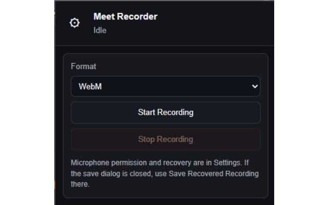

# Meet Recorder

Extension for recording Google Meet sessions locally, including tab audio/video and microphone audio when the Meet microphone is unmuted.

## Features

- Record Google Meet tab audio and video locally
- Mix microphone audio only while the Meet microphone is enabled
- Control recording from the popup or from the Meet page overlay
- Show recording status and elapsed recording time on the Meet page
- Keep recovery options for unfinished or interrupted recordings
- Save recordings from the extension when recording is finished

## Supported Pages

- `https://meet.google.com/*`

## Privacy

- Recordings are created locally in the browser
- The extension does not upload recordings or meeting data to external servers
- Microphone access is requested only for recording microphone audio

## Installation

- 🟢 [Chrome Web Store](https://chromewebstore.google.com/detail/ojihdjjgamikdnolaadnflaiklalaoeh)
- 🦊 [Firefox Add-ons](https://addons.mozilla.org/firefox/addon/meet-recorder/)

## Screenshots

**1. Recording controls and current session status**

## Contributing

Feel free to open issues or submit pull requests to improve the extension.
